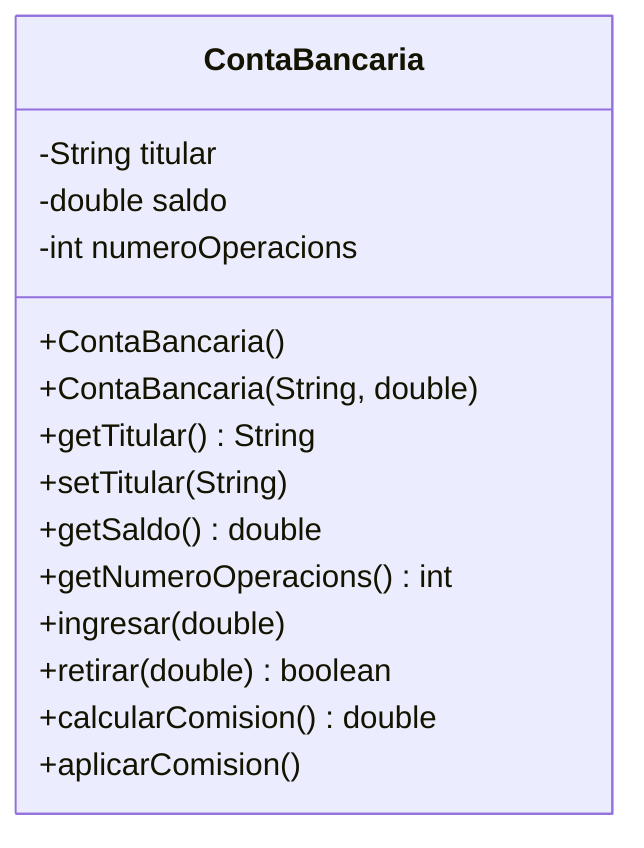

```mermaid
classDiagram
    class ContaBancaria {
        -String titular
        -double saldo
        -int numeroOperacions
        +ContaBancaria()
        +ContaBancaria(String, double)
        +getTitular() String
        +setTitular(String)
        +getSaldo() double
        +getNumeroOperacions() int
        +ingresar(double)
        +retirar(double) boolean
        +calcularComision() double
        +aplicarComision()
    }
```