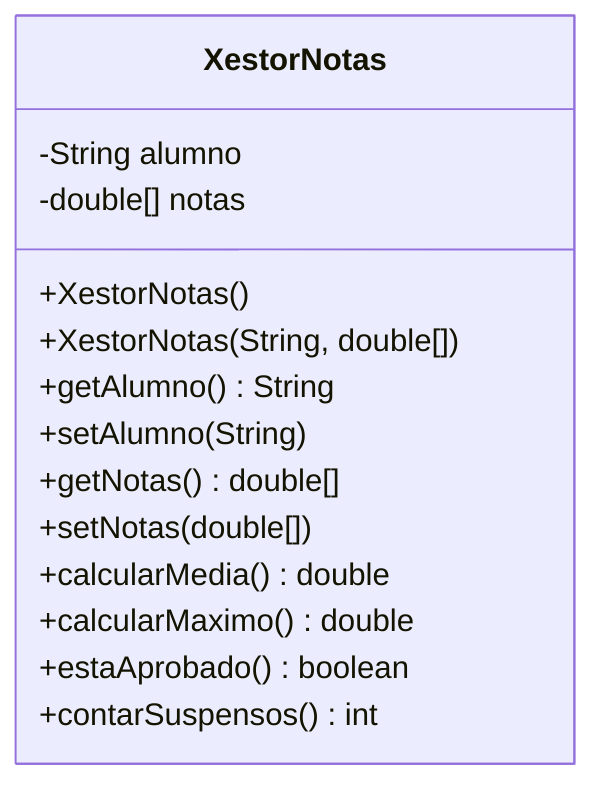

```mermaid
    classDiagram
        class XestorNotas {
            -String alumno
            -double[] notas
            +XestorNotas()
            +XestorNotas(String, double[])
            +getAlumno() String
            +setAlumno(String)
            +getNotas() double[]
            +setNotas(double[])
            +calcularMedia() double
            +calcularMaximo() double
            +estaAprobado() boolean
            +contarSuspensos() int
}
```