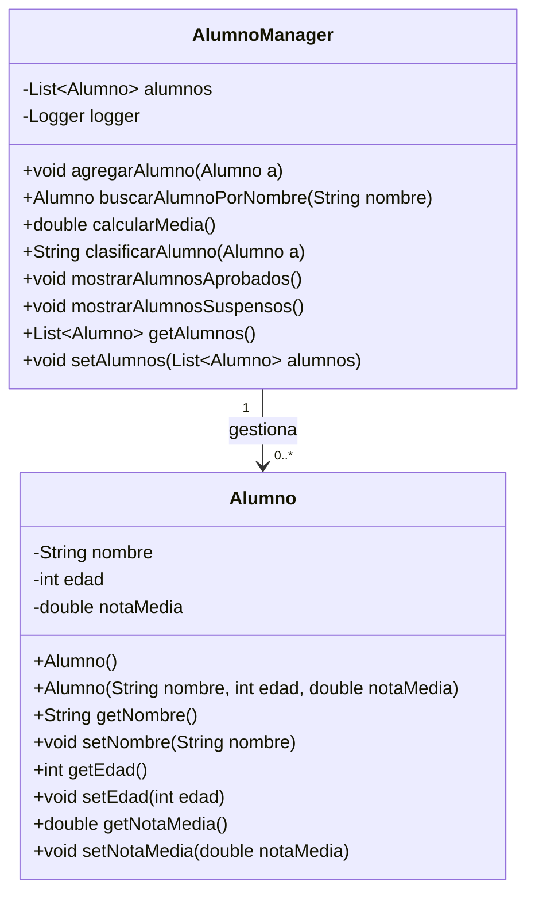

```mermaid
    classDiagram
        class Alumno {
        -String nombre
        -int edad
        -double notaMedia
        +Alumno()
        +Alumno(String nombre, int edad, double notaMedia)
        +String getNombre()
        +void setNombre(String nombre)
        +int getEdad()
        +void setEdad(int edad)
        +double getNotaMedia()
        +void setNotaMedia(double notaMedia)
    }

    class AlumnoManager {
        -List~Alumno~ alumnos
        -Logger logger
        +void agregarAlumno(Alumno a)
        +Alumno buscarAlumnoPorNombre(String nombre)
        +double calcularMedia()
        +String clasificarAlumno(Alumno a)
        +void mostrarAlumnosAprobados()
        +void mostrarAlumnosSuspensos()
        +List~Alumno~ getAlumnos()
        +void setAlumnos(List~Alumno~ alumnos)
    }

AlumnoManager "1" --> "0..*" Alumno : gestiona
```