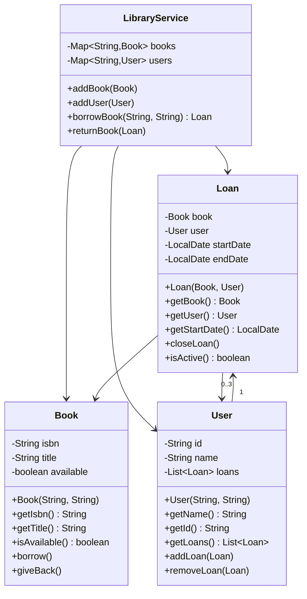

```mermaid
classDiagram
    class Book {
        -String isbn
        -String title
        -boolean available
        +Book(String, String)
        +getIsbn() String
        +getTitle() String
        +isAvailable() boolean
        +borrow()
        +giveBack()
    }

    class Loan {
        -Book book
        -User user
        -LocalDate startDate
        -LocalDate endDate
        +Loan(Book, User)
        +getBook() Book
        +getUser() User
        +getStartDate() LocalDate
        +closeLoan()
        +isActive() boolean
    }

    class User {
        -String id
        -String name
        -List~Loan~ loans
        +User(String, String)
        +getName() String
        +getId() String
        +getLoans() List~Loan~
        +addLoan(Loan)
        +removeLoan(Loan)
    }

    class LibraryService {
        -Map~String,Book~ books
        -Map~String,User~ users
        +addBook(Book)
        +addUser(User)
        +borrowBook(String, String) Loan
        +returnBook(Loan)
    }

    LibraryService --> Book
    LibraryService --> User
    LibraryService --> Loan
    Loan --> Book
    Loan --> User
    User "1" --> "0..3" Loan
```