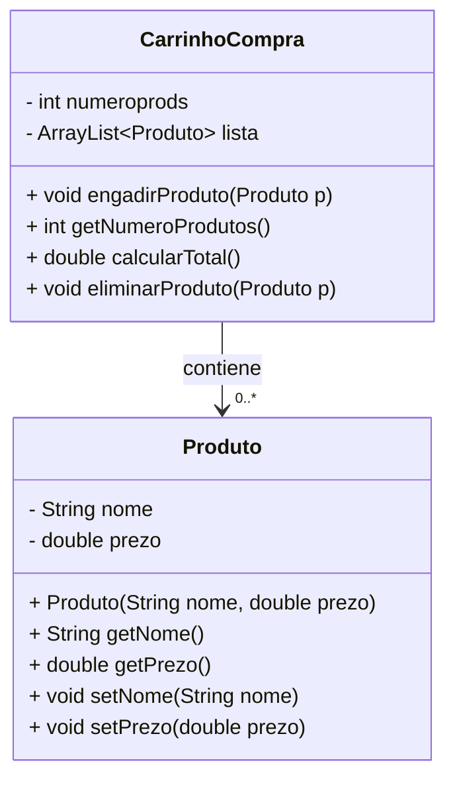

```mermaid
classDiagram

class Produto {
    - String nome
    - double prezo

    + Produto(String nome, double prezo)

    + String getNome()
    + double getPrezo()

    + void setNome(String nome)
    + void setPrezo(double prezo)
}

class CarrinhoCompra {
    - int numeroprods
    - ArrayList~Produto~ lista

    + void engadirProduto(Produto p)
    + int getNumeroProdutos()
    + double calcularTotal()
    + void eliminarProduto(Produto p)
}

CarrinhoCompra --> "0..*" Produto : contiene
```