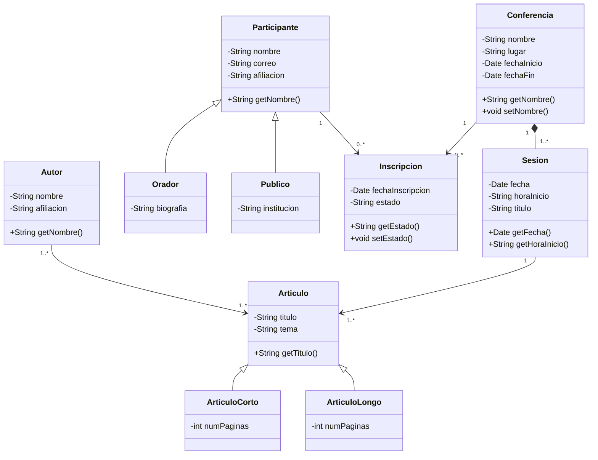

```mermaid
    classDiagram
        class Conferencia{
            -String nombre
            -String lugar
            -Date fechaInicio
            -Date fechaFin
            +String getNombre()
            +void setNombre()
        }
        class Sesion{
            -Date fecha
            -String horaInicio
            -String titulo
            +Date getFecha()
            +String getHoraInicio()
        }
        class Participante{
            -String nombre
            -String correo
            -String afiliacion
            +String getNombre()
        }
        class Orador{
            -String biografia
        }

        class Publico{
            -String institucion
        }
        class Inscripcion{
            -Date fechaInscripcion
            -String estado
            +String getEstado()
            +void setEstado()
        }
        class Articulo{
            -String titulo
            -String tema
            +String getTitulo()
        }
        class ArticuloCorto{
            -int numPaginas
        }
        class ArticuloLongo{
            -int numPaginas
        }
        class Autor{
            -String nombre
            -String afiliacion
            +String getNombre()
        }
        Conferencia "1" *-- "1..*" Sesion
        Conferencia "1" --> "0..*" Inscripcion
        Participante <|-- Orador
        Participante <|-- Publico
        Participante "1" --> "0..*" Inscripcion
        Sesion "1" --> "1..*" Articulo
        Articulo <|-- ArticuloCorto
        Articulo <|-- ArticuloLongo
        Autor "1..*" --> "1..*" Articulo
```